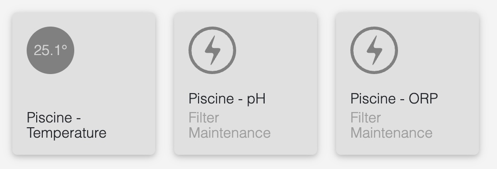

# homebridge-iopoolmonitor

A small Homebridge plugin to monitor your swimming pool(s) using [iopool](https://iopool.com) product & service. This plugin will monitor Temperature, pH, and ORP.\
\
pH and ORP are shown as air quality sensors and show their respective values as ozone density. You can specify a warning and an alert threshold to cause the "air quality" sensor to display good, inferior, or poor quality based on compliance.\
Due to limitations of the ozone density characteristic, the following workarounds are in place for displaying values in the Home app:
* pH displayed is multiplied by 10 to preserve the value after the decimal point.
* ORP displays a maximum of 1000 as it is the maximum value for the characteristic.
These are for display purposes only. The true values are still used for calculating compliance and accurate values should be used in your Homebridge configuration.\
\
Based on https://github.com/GurYN/homebridge-iopool



# Installation
This plugin needs Homebridge server installed, follow [Homebridge website](https://homebridge.io/) to install it.

Once Homebridge server installed, you can add this plugin from the server UI or using NPM command:
```bash
npm install -g homebridge-iopoolmonitor
```

# Configuration
You need to configure the plugin before using it. Please see the config settings in the UI or update your config.json file in your server directory.

```json
"platforms": [
        ...,
        {
            "platform": "HomebridgeIopoolMonitor",
            "name": "iopool",
            "token": "[YOUR IOPOOL TOKEN]",
            "delay": 15,
            "pHMinWarn": 7.1,
            "pHMinAlert": 6.8,
            "pHMaxWarn": 7.7,
            "pHMaxAlert": 8.1,
            "OrpMinWarn": 650,
            "OrpMinAlert": 550,
            "OrpMaxWarn": 800,
            "OrpMaxAlert": 1000
        }
    ],
```
__Note:__ The token can be retrieved in the iopool mobile application.
